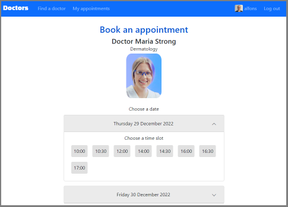

## Website for a hospital to allow patients to find doctors, book and manage appointments.

CS50's web course capstone project, developed using Python/Django, JavaScript and Bootstrap.

The application provides functionality to:
1. Search for doctors, by name or specialty, asynchronously. The list of suggested doctors is updated as the patient types in the search box.
2. Book appointments: view doctor availabilities by date, and choose time slots.
3. Receive automatically-generated confirmation emails with appointment details.
4. Manage appointments: view upcoming consultations and cancel them.
5. Upload photos.

Moreover, the application implements:
- Favicon displayed next to page title.
- Responsive navigation bar that collapses on mobile devices, and responsive components such as the doctor cards.
- Query to search across multiple fields: first name, last name and medical specialty.
- Escaping user-created text from JSON responses to prevent XSS attacks.
- Matched text highlighting. Doctor search results show the portion/s of text that matched the search term.
- Caching of doctor search results in frontend to reduce number of asynchronous requests.
- Time availabilities for selected date are fetched asynchronously.
- Dialog boxes to confirm actions: booking an appointment and cancelling an appointment.
- Dialog box, displayed on top of user details page, to upload photos.
- Validation of file size of uploaded photos.
- Patients and doctors can update their personal data.

## Main folders and files
| Folder/file            | Description   |
| ---------------------- | ------------- |
| `doctors/models.py`    | Models `Specialty` to represent medical specialties, `User` to create both patients and doctors (the field `is_doctor` distinguishes them), and `Appointment` to book consultations. |
| `doctors/views.py`     | Views to serve pages: `index` to search for doctors, `book` to book appointments, `appointments` to view and manage upcoming appointments, `register`, `user_update`, `login_view`, `logout_view`; and API endpoints for asynchronous requests: `search` to get doctors that match a search term, `time_availabilities` to get time slots for a given doctor and date, `appointment_book`, `appointment_cancel`, and `upload` to add pictures. |
| `doctors/forms.py`     | Forms broadly used to prevent CSRF attacks: `BookForm` to book an appointment, `CancelForm` to cancel an appointment, `UserCreateForm` to register new users, `UserUpdateForm` to update user personal data, `PictureForm` to upload user pictures, and `LoginForm` to log users in. |
| `doctors/helpers.py`   | Utility functions `doctor_to_dict` to convert the doctor object returned by a database query into the object structure expected by the front end code to display search results, `next_weekday` and `next_weekdays` to get the following weekday/s (skipping weekend days) for a given date, and `confirmation_email` and `cancellation_email` to send emails to confirm new appointments and cancellations. |
| `doctors/static/doctors/main.js`    | Front end JavaScript functions to make asynchronous requests: `searchDoctors`, `getAvailabilities`, `confirmBooking`, `confirmCancellation` and `submitPicture`; and utility functions: `showElement`, `hideElement`, `showDoctorFields`, `buildDoctorCard`, `markMatches`, `initializeConfirmBookingModal` and `initializeConfirmCancellationModal`. |
| `doctors/static/doctors/styles.css` | Styling rules. |
| `doctors_project/.env` | File with secrets `SECRET_KEY`, `EMAIL_HOST_USER`, and `EMAIL_HOST_PASSWORD` as explained in the next section. Do not commit this file to version control. Create your own `.env` file and add it to your `.gitignore` file. |
| `images/`              | Folder with pictures uploaded by patients and doctors. |
| `scripts/load_data.py` | Script to populate the database with some doctors, patients and appointments. To run it, execute: `python manage.py runscript load_data`.|

## How to run the application
- Within the root folder, create and activate a virtual environment, e.g.:  
    `python -m venv venv`  
    `venv\Scripts\activate`
    - The second `venv` in the first command is a suggested name for the virtual environment folder. You can change it.
- Install the required libraries. Make sure your virtual environment is activated when you execute:  
    `pip install -r requirements.txt`
- Within the folder `doctors_project`, create a `.env` file and store your secrets inside:  
    `SECRET_KEY=my_secret_key`  
    `EMAIL_HOST_USER=my_username`  
    `EMAIL_HOST_PASSWORD=my_app_password`  
    - To send emails using a gmail account, you need to go to your google account parameters, and under security, choose 'application passwords' to generate a password for the application.
    - If you do not use the gmail service, you will need to modify the settings `EMAIL_HOST` and `EMAIL_PORT` at the bottom of the file `doctors_project/settings.py`.
    - If you do not configure the application to send emails, all other features will still work.
- Make sure your virtual environment is activated when you run the rest of commands below:  
    `venv\Scripts\activate`
- Create the database:  
    `python manage.py migrate`
- Load some initial data into the database:  
    `python manage.py runscript load_data`
- Create a super user account:  
    `python manage.py createsuperuser`
- Launch the development server:  
    `python manage.py runserver`
- Visit `http://127.0.0.1:8000/`, register, log in, and start searching for doctors.